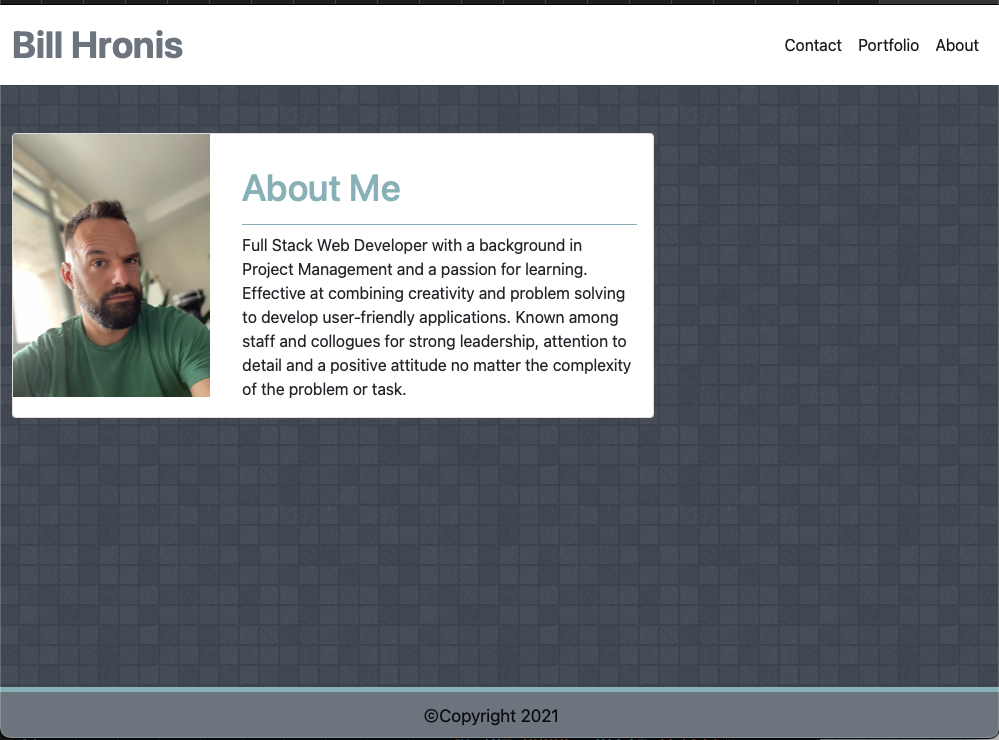
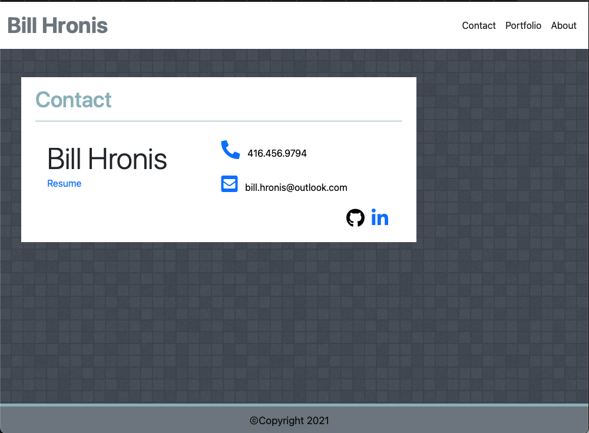
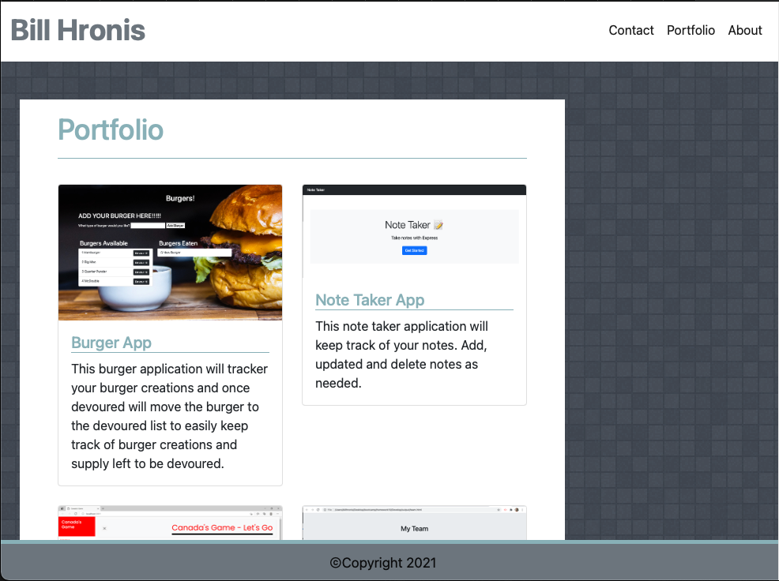

# Updated Profile 
  

## Table of Contents 
- [Updated Profile](#updated-profile)
  - [Table of Contents](#table-of-contents)
  - [Description](#description)
  - [Installation Instructions](#installation-instructions)
  - [Usage](#usage)
  - [Licensing](#licensing)
  - [Contributing](#contributing)
  - [Tests Code](#tests-code)
  - [Images of the Appliication](#images-of-the-appliication)
  - [GitHub Direct Link:](#github-direct-link)
  - [Questions](#questions)
    
## Description
    This is my public profile on GitHub.  It showcases some of the applications I have built and projects I have contributed.  There are thre main components, an About page that provides some information about me, a Contact page that links to all ways that I can be reached, and a Portfolio page that showcases some of the applications I have worked on.
    
## Installation Instructions 
    There are no installation instructions.  Please follow the link below to access the GitHub page hosting this site.

## Usage
    None
    
## Licensing
      

    
## Contributing
    No contributions on this site.
    
## Tests Code
    To test, please follow the link below to the GitHub page and click around.  It's that simple, nothing to install on this one.

## Images of the Appliication
Please find screenshots and a brief video showcasing the application below

## GitHub Direct Link:  

[Bill's Portfolio](https://daze77.github.io/updatedPortfolio/)

    
## Questions
    
You can find me here on [GitHub](http://github.com/daze77), or contact me via [email](mailto:daze77@gmail.com)  
    