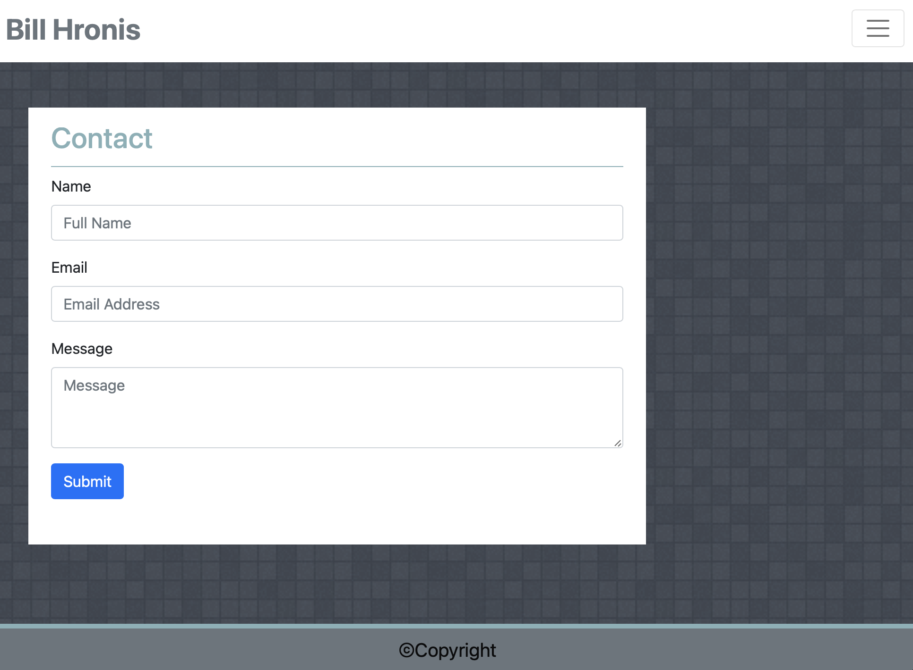
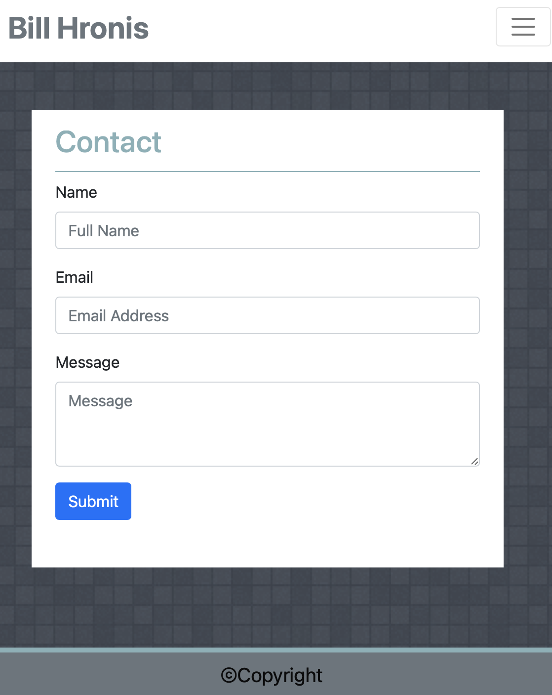

# Responsive Portfolio

This is a responsive portfolio that has been designed so that all images and text from each link will automatically adjust to fit and be readable on any sized screen.  This site has been designed with a mobile first vision and expanded to adapt to larger screen sizes.

We used bootsrap 5.0 to develop the responsive deisgn with minimal manual custom css used.

## __A link to the git repo hosuing this site can be found here:__  https://daze77.github.io/responsiveDesign/

## __Following are some imgaes of the responsive design as a reference:__

### About Page:

### Contact Page:

### Portfolio Page:

